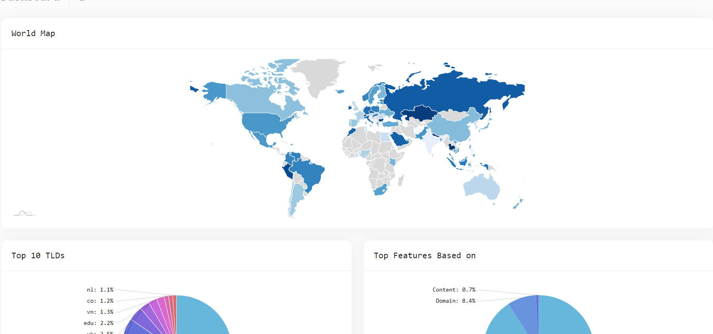

# Phishing-detection-ML

... is a part of Project ChongLuaDao by using Model **D**eep **L**earning to detect the Phishing Website

[![Contributors][contributors-shield]][contributors-url]
[![Forks][forks-shield]][forks-url]
[![Stargazers][stars-shield]][stars-url]
[![MIT License][license-shield]][license-url]
[![Organization][organization-shield]][organization-url]
[![LinkedIn][project-shield]][project-url]

### Requirements

-   Python **3.7.x** | **3.8.x**

### Server tested on

-   Windows 10
-   Ubuntu 18.04

### Source for collecting data
#### Blacklist
- https://phishingreel.io/api/v1/panels/today
- https://api.chongluadao.vn/v1/blacklist
- http://data.phishtank.com/data/online-valid.csv (update every hour)
- https://raw.githubusercontent.com/mitchellkrogza/Phishing.Database/master/phishing-links/output/domains/ACTIVE/list (update every day)

#### Whitelist
- https://api.chongluadao.vn/v1/whitelist
- https://www.alexa.com/topsites/countries/VN
- https://webrank.vn/top-website-vietnam
- https://majestic.com/reports/majestic-million
- https://github.com/csirtgadgets/suspect-domains-dataset/blob/master/whitelist.txt

## Research (On going)
- https://www.academia.edu/10918579/A_WEB_CONTENT_ANALYTICS_ARCHITECTURE_FOR_MALICIOUS_JAVASCRIPT_DETECTION
- https://www.sciencedirect.com/science/article/pii/S1568494619305022
- https://www.just.edu.jo/~munzer/MyPubs/MALURLs_ITA2011.pdf
- https://www.researchgate.net/publication/228906286_Visual-Similarity-Based_Phishing_Detection
- https://www.mdpi.com/2073-8994/12/10/1681/pdf

## References
- http://docnum.univ-lorraine.fr/public/DDOC_T_2015_0058_MARCHAL.pdf
- https://research.aalto.fi/en/datasets/phishstorm-phishing-legitimate-url-dataset
- https://www.sciencedirect.com/science/article/pii/S1877050920310966
- https://www.atlantis-press.com/proceedings/iccsee-13/4487
- https://repository.asu.edu/attachments/189603/content/Namasivayam_asu_0010N_17146.pdf

[contributors-shield]: https://img.shields.io/github/contributors/othneildrew/Best-README-Template.svg?style=for-the-badge
[contributors-url]: https://github.com/aidenpearce001/Phishing-detection-ML/graphs/contributors
[forks-shield]: https://img.shields.io/github/forks/othneildrew/Best-README-Template.svg?style=for-the-badge
[forks-url]: https://github.com/othneildrew/Best-README-Template/network/members
[stars-shield]: https://img.shields.io/github/stars/othneildrew/Best-README-Template.svg?style=for-the-badge
[stars-url]: https://github.com/othneildrew/Best-README-Template/stargazers
[organization-shield]: https://img.shields.io/badge/organization-YoungIT-lightgrey?style=for-the-badge&logo=appveyor
[organization-url]: https://www.facebook.com/youngit.org
[license-shield]: https://img.shields.io/github/license/othneildrew/Best-README-Template.svg?style=for-the-badge
[license-url]: https://github.com/othneildrew/Best-README-Template/blob/master/LICENSE.txt
[projoect-shield]: https://img.shields.io/badge/Project-chongluadao-green?style=for-the-badge
[projoect-url]: https://www.facebook.com/chongluadao.vn
